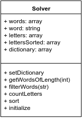

# hangman solver

A hangman game script solver.

## Technologies and Methodologies used

This script was developed using:
- TDD (jasmine + karma)
- Promises (used to execute the script when everything is ready)
- gulp
- BrowserSync
- Node
- Bower
- jQuery

## Approach used

The game gives a few parameters to consider, one of them is the length. Since the length is a fix variable, the script looks for the word in a reduced dictionary of words grouped by length.

The script count the words per letter, and the letters are sort in a descendant order, the most common letter is the one used to guess, followed by the next one.

```
node groupwords.js
```

The script is execute when the file index.html is open.

## Script and test files

The solver scripts files are inside the folder 'hangmansolver', the script file is at /hangmansolver/app/scripts/hangmansolver.js. The test file is at /hangmansolver/test/spec/hangmansolver.spec.js. To run the tests, execute this commands:

```
npm install -g bower gulp jasmine
npm install
bower install
gulp serve:test
```

## Algorithm used

This image shows the algorithm and classes-like objects used:




## Result

This is the result given by the game, after the script finished:

```
65794a7a644746796447566b496a7030636e566c4c434a3362334a6b63313977624746355a5751694f6e7369656d467a496a7037496d64315a584e7a5a584d694f6a5173496e64796232356e583264315a584e7a5a584d694f6a4573496d4e76625842735a58526c5a43493664484a315a537769633246745a5639735a5852305a5849694f6a42394c434a6c5a5773694f6e73695a33566c63334e6c637949364d79776964334a76626d64665a33566c63334e6c637949364d537769593239746347786c6447566b496a7030636e566c4c434a7a5957316c5832786c6448526c636949364d483073496d68765a53493665794a6e6457567a6332567a496a6f784d53776964334a76626d64665a33566c63334e6c637949364f437769593239746347786c6447566b496a7030636e566c4c434a7a5957316c5832786c6448526c636949364d483073496d64765969493665794a6e6457567a6332567a496a6f784d79776964334a76626d64665a33566c63334e6c637949364d544173496d4e76625842735a58526c5a4349365a6d467363325573496e4e68625756666247563064475679496a6f77665377695a326c6c496a7037496d64315a584e7a5a584d694f6a45794c434a33636d39755a31396e6457567a6332567a496a6f354c434a6a62323177624756305a5751694f6e527964575573496e4e68625756666247563064475679496a6f77665377695a326c6e496a7037496d64315a584e7a5a584d694f6a6b73496e64796232356e583264315a584e7a5a584d694f6a6373496d4e76625842735a58526c5a43493664484a315a537769633246745a5639735a5852305a5849694f6a42394c434a73645751694f6e73695a33566c63334e6c637949364d544d73496e64796232356e583264315a584e7a5a584d694f6a45774c434a6a62323177624756305a5751694f6d5a6862484e6c4c434a7a5957316c5832786c6448526c636949364d483073496e52706379493665794a6e6457567a6332567a496a6f784d69776964334a76626d64665a33566c63334e6c637949364f537769593239746347786c6447566b496a7030636e566c4c434a7a5957316c5832786c6448526c636949364d483073496d56796253493665794a6e6457567a6332567a496a6f354c434a33636d39755a31396e6457567a6332567a496a6f324c434a6a62323177624756305a5751694f6e527964575573496e4e68625756666247563064475679496a6f7766537769646d466c496a7037496d64315a584e7a5a584d694f6a45794c434a33636d39755a31396e6457567a6332567a496a6f784d437769593239746347786c6447566b496a706d5957787a5a537769633246745a5639735a5852305a5849694f6a42394c434a766147566b496a7037496d64315a584e7a5a584d694f6a6373496e64796232356e583264315a584e7a5a584d694f6a4d73496d4e76625842735a58526c5a43493664484a315a537769633246745a5639735a5852305a5849694f6a42394c434a725a574a7a496a7037496d64315a584e7a5a584d694f6a457a4c434a33636d39755a31396e6457567a6332567a496a6f784d437769593239746347786c6447566b496a706d5957787a5a537769633246745a5639735a5852305a5849694f6a42394c434a6e64584a75496a7037496d64315a584e7a5a584d694f6a457a4c434a33636d39755a31396e6457567a6332567a496a6f354c434a6a62323177624756305a5751694f6e527964575573496e4e68625756666247563064475679496a6f7766537769596e56366569493665794a6e6457567a6332567a496a6f784d69776964334a76626d64665a33566c63334e6c637949364d544173496d4e76625842735a58526c5a4349365a6d467363325573496e4e68625756666247563064475679496a6f776653776962324e6f5a53493665794a6e6457567a6332567a496a6f784d43776964334a76626d64665a33566c63334e6c637949364e697769593239746347786c6447566b496a7030636e566c4c434a7a5957316c5832786c6448526c636949364d483073496d683563484d694f6e73695a33566c63334e6c637949364d544973496e64796232356e583264315a584e7a5a584d694f6a6773496d4e76625842735a58526c5a43493664484a315a537769633246745a5639735a5852305a5849694f6a42394c434a7a59335674496a7037496d64315a584e7a5a584d694f6a45774c434a33636d39755a31396e6457567a6332567a496a6f324c434a6a62323177624756305a5751694f6e527964575573496e4e68625756666247563064475679496a6f7766537769625746756553493665794a6e6457567a6332567a496a6f784d53776964334a76626d64665a33566c63334e6c637949364e797769593239746347786c6447566b496a7030636e566c4c434a7a5957316c5832786c6448526c636949364d483073496d3968636e4d694f6e73695a33566c63334e6c637949364d545173496e64796232356e583264315a584e7a5a584d694f6a45774c434a6a62323177624756305a5751694f6d5a6862484e6c4c434a7a5957316c5832786c6448526c636949364d483073496d4e735a5863694f6e73695a33566c63334e6c637949364d544973496e64796232356e583264315a584e7a5a584d694f6a6773496d4e76625842735a58526c5a43493664484a315a537769633246745a5639735a5852305a5849694f6a42394c434a6e62324a686369493665794a6e6457567a6332567a496a6f354c434a33636d39755a31396e6457567a6332567a496a6f304c434a6a62323177624756305a5751694f6e527964575573496e4e68625756666247563064475679496a6f776653776963336468636e51694f6e73695a33566c63334e6c637949364f53776964334a76626d64665a33566c63334e6c637949364e437769593239746347786c6447566b496a7030636e566c4c434a7a5957316c5832786c6448526c636949364d483073496d397a61575679496a7037496d64315a584e7a5a584d694f6a6b73496e64796232356e583264315a584e7a5a584d694f6a5173496d4e76625842735a58526c5a43493664484a315a537769633246745a5639735a5852305a5849694f6a42394c434a6865476c305a53493665794a6e6457567a6332567a496a6f784d69776964334a76626d64665a33566c63334e6c637949364e797769593239746347786c6447566b496a7030636e566c4c434a7a5957316c5832786c6448526c636949364d483073496d646c59584a6c496a7037496d64315a584e7a5a584d694f6a6773496e64796232356e583264315a584e7a5a584d694f6a5173496d4e76625842735a58526c5a43493664484a315a537769633246745a5639735a5852305a5849694f6a42394c434a70646d6c6c6379493665794a6e6457567a6332567a496a6f314c434a33636d39755a31396e6457567a6332567a496a6f784c434a6a62323177624756305a5751694f6e527964575573496e4e68625756666247563064475679496a6f7766537769646d467463484d694f6e73695a33566c63334e6c637949364d545573496e64796232356e583264315a584e7a5a584d694f6a45774c434a6a62323177624756305a5751694f6d5a6862484e6c4c434a7a5957316c5832786c6448526c636949364d483073496d467964476c7a496a7037496d64315a584e7a5a584d694f6a6373496e64796232356e583264315a584e7a5a584d694f6a4973496d4e76625842735a58526c5a43493664484a315a537769633246745a5639735a5852305a5849694f6a42394c434a74595735705979493665794a6e6457567a6332567a496a6f784d69776964334a76626d64665a33566c63334e6c637949364e797769593239746347786c6447566b496a7030636e566c4c434a7a5957316c5832786c6448526c636949364d483073496e5a6861584a7a496a7037496d64315a584e7a5a584d694f6a6773496e64796232356e583264315a584e7a5a584d694f6a4d73496d4e76625842735a58526c5a43493664484a315a537769633246745a5639735a5852305a5849694f6a42394c434a7a59573169595777694f6e73695a33566c63334e6c637949364e79776964334a76626d64665a33566c63334e6c637949364d697769593239746347786c6447566b496a7030636e566c4c434a7a5957316c5832786c6448526c636949364d483073496e5276623278705a53493665794a6e6457567a6332567a496a6f784d43776964334a76626d64665a33566c63334e6c637949364e537769593239746347786c6447566b496a7030636e566c4c434a7a5957316c5832786c6448526c636949364d483073496e4e775a574e726553493665794a6e6457567a6332567a496a6f784d79776964334a76626d64665a33566c63334e6c637949364e797769593239746347786c6447566b496a7030636e566c4c434a7a5957316c5832786c6448526c636949364d483073496d31315a6d5a735a53493665794a6e6457567a6332567a496a6f784e43776964334a76626d64665a33566c63334e6c637949364f537769593239746347786c6447566b496a7030636e566c4c434a7a5957316c5832786c6448526c636949364d483073496d31705a4764705a53493665794a6e6457567a6332567a496a6f344c434a33636d39755a31396e6457567a6332567a496a6f7a4c434a6a62323177624756305a5751694f6e527964575573496e4e68625756666247563064475679496a6f7766537769614746755a474634496a7037496d64315a584e7a5a584d694f6a45304c434a33636d39755a31396e6457567a6332567a496a6f354c434a6a62323177624756305a5751694f6e527964575573496e4e68625756666247563064475679496a6f77665377695932686c5958527a496a7037496d64315a584e7a5a584d694f6a6b73496e64796232356e583264315a584e7a5a584d694f6a4d73496d4e76625842735a58526c5a43493664484a315a537769633246745a5639735a5852305a5849694f6a42394c434a746157356b5a5849694f6e73695a33566c63334e6c637949364d544973496e64796232356e583264315a584e7a5a584d694f6a5973496d4e76625842735a58526c5a43493664484a315a537769633246745a5639735a5852305a5849694f6a42394c434a7961575a6c62486b694f6e73695a33566c63334e6c637949364f53776964334a76626d64665a33566c63334e6c637949364d797769593239746347786c6447566b496a7030636e566c4c434a7a5957316c5832786c6448526c636949364d483073496d3168596d56735953493665794a6e6457567a6332567a496a6f334c434a33636d39755a31396e6457567a6332567a496a6f794c434a6a62323177624756305a5751694f6e527964575573496e4e68625756666247563064475679496a6f7766537769646d6c795a5778686553493665794a6e6457567a6332567a496a6f784d53776964334a76626d64665a33566c63334e6c637949364e437769593239746347786c6447566b496a7030636e566c4c434a7a5957316c5832786c6448526c636949364d483073496e56776447467361334d694f6e73695a33566c63334e6c637949364d544573496e64796232356e583264315a584e7a5a584d694f6a5173496d4e76625842735a58526c5a43493664484a315a537769633246745a5639735a5852305a5849694f6a42394c434a31626d6c786457567a496a7037496d64315a584e7a5a584d694f6a45784c434a33636d39755a31396e6457567a6332567a496a6f314c434a6a62323177624756305a5751694f6e527964575573496e4e68625756666247563064475679496a6f7766537769633352315a4752735a53493665794a6e6457567a6332567a496a6f784d69776964334a76626d64665a33566c63334e6c637949364e697769593239746347786c6447566b496a7030636e566c4c434a7a5957316c5832786c6448526c636949364d483073496d316c5a476c6a61334d694f6e73695a33566c63334e6c637949364d544973496e64796232356e583264315a584e7a5a584d694f6a5573496d4e76625842735a58526c5a43493664484a315a537769633246745a5639735a5852305a5849694f6a42394c434a6b645735755957646c496a7037496d64315a584e7a5a584d694f6a6b73496e64796232356e583264315a584e7a5a584d694f6a4d73496d4e76625842735a58526c5a43493664484a315a537769633246745a5639735a5852305a5849694f6a42394c434a7a59585235636d467a496a7037496d64315a584e7a5a584d694f6a6373496e64796232356e583264315a584e7a5a584d694f6a4973496d4e76625842735a58526c5a43493664484a315a537769633246745a5639735a5852305a5849694f6a42394c434a6a5957356b6157566b496a7037496d64315a584e7a5a584d694f6a45784c434a33636d39755a31396e6457567a6332567a496a6f314c434a6a62323177624756305a5751694f6e527964575573496e4e68625756666247563064475679496a6f7766537769596d56705a32356c6379493665794a6e6457567a6332567a496a6f334c434a33636d39755a31396e6457567a6332567a496a6f784c434a6a62323177624756305a5751694f6e527964575573496e4e68625756666247563064475679496a6f77665377695a6d6c76636d6c756379493665794a6e6457567a6332567a496a6f344c434a33636d39755a31396e6457567a6332567a496a6f794c434a6a62323177624756305a5751694f6e527964575573496e4e68625756666247563064475679496a6f7766583073496d4e76625842735a58526c5a46393362334a6b637949364d4377695a6d46706247566b58336476636d527a496a6f774c434a7a64474679644639306157316c496a6f784e4455774e6a6b304d7a67324e4459774c434a6c626d526664476c745a5349364d5451314d4459354e444d354d7a49784d79776959335679636d56756446396e6457567a6332567a496a6f7766513d3d
```

Copyright: Cesar Pino @ 2015